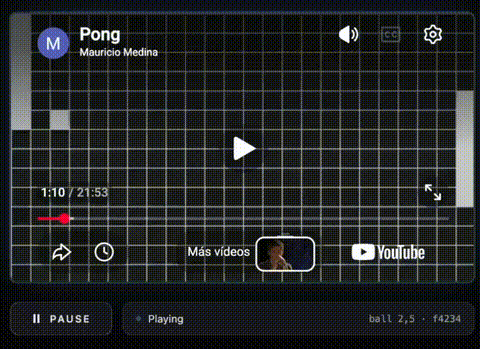

# Video Game

Games where the video player is the render engine.

The idea is to use a video for the graphics, nothing gets drawn while you play. Every position the game can be
in is stored in a video, one state per frame. So playing is just 
running the game logic, figuring out which frame matches the current state, and
telling the video player to jump to it.




▶ **[Play Pong with YouTube](https://mauri-medina.github.io/video-game/)** ·
[the video it plays](https://www.youtube.com/watch?v=meFEZtn-Dqw)

---

## Pong

The board is a 24×14 grid of 22px cells, so 528×308 pixels. A state is the position of the
three things that move, the left paddle, the ball and the right paddle, each one as
grid coordinates:

```
(paddle_left_x, paddle_left_y, ball_x, ball_y, paddle_right_x, paddle_right_y)
```

### 1. Generate all the states — `video_generator_pong.py`

The generator goes through every state one by one. The ball moves left to right
across a row, then down to the next row. When the ball has covered the whole board,
the right paddle moves down one cell and the ball starts over. When the right
paddle reaches the bottom, the left paddle moves down one cell and so on until all possible states have been covered.

Every state is saved as a frame of the video, and written as a
row of a CSV:

```csv
paddle_left_x,paddle_left_y,ball_x,ball_y,paddle_right_x,paddle_right_y,frame
0,0,1,0,23,0,1
0,0,2,0,23,0,4
```

The video has the images and the CSV says which frame corresponds to each state.

| | |
|---|---|
| States | 26,244 |
| Frames | 78,732 |
| Duration | 21:52 |
| Size | 4.8 MB  |

### 2. Play it

Play pong in a video player with the generated video.
```python
  python video_player_pong.py
```
The game loop is normal Pong, only moving a cell at a time.

In each frame, the new positions are calculated and are used to look up the frame number in the CSV to get the frame number corresponding to the current state

## Play Pong on YouTube

### Youtube Api: get frames

The YouTube API doesn't know about frame numbers. To move around it uses [seekTo](https://developers.google.com/youtube/iframe_api_reference#seekTo), so the frame has to be turned into a timestamp:

```js
player.seekTo(frame / 60, true);
```

Frame 74,010 becomes second 1233.5. YouTube has to figure out on its own which
frame falls on that timestamp, and it doesn't always get it right, it can end up
one or two frames ahead or behind the one we asked for. And if it shows the wrong
frame, you see positions that aren't the state the game is in.

### Store diplucated frames

The generator doesn't write each state just once. It writes it `repeat` times in
a row and the CSV points to the copy in the middle:

```
frame:   ...  73  74  75  ...
state:      [ S   S   S ]
                  ↑
              seekTo aims here
```

That way, if the seek misses by one frame in either direction, it lands on a copy
of the same image and you don't notice. More copies means more room for error but
also a longer video.

